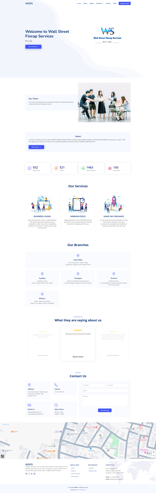
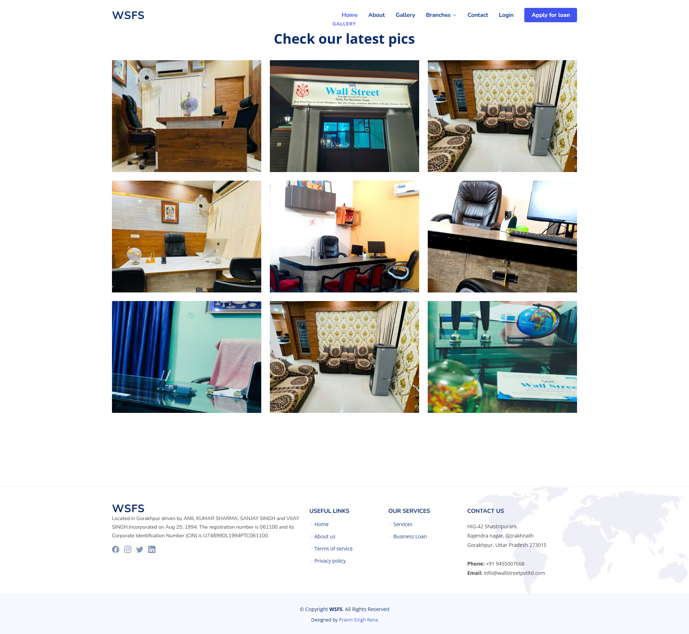
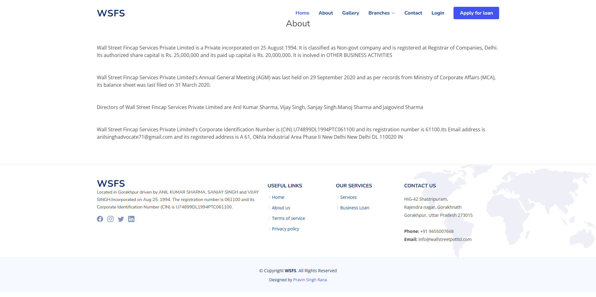
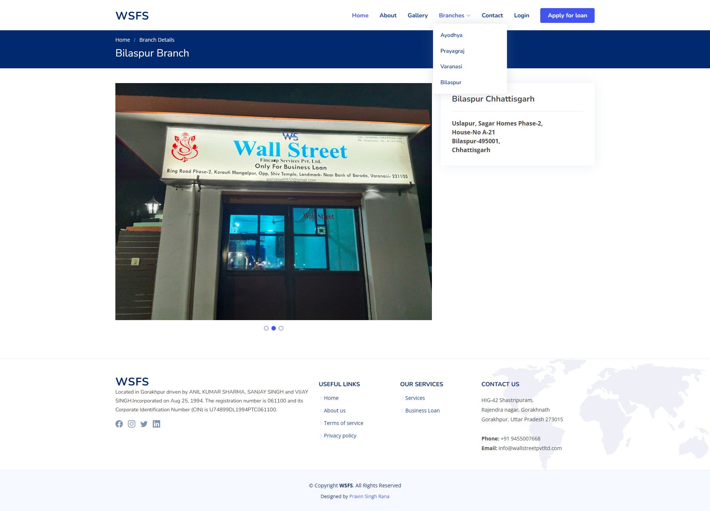
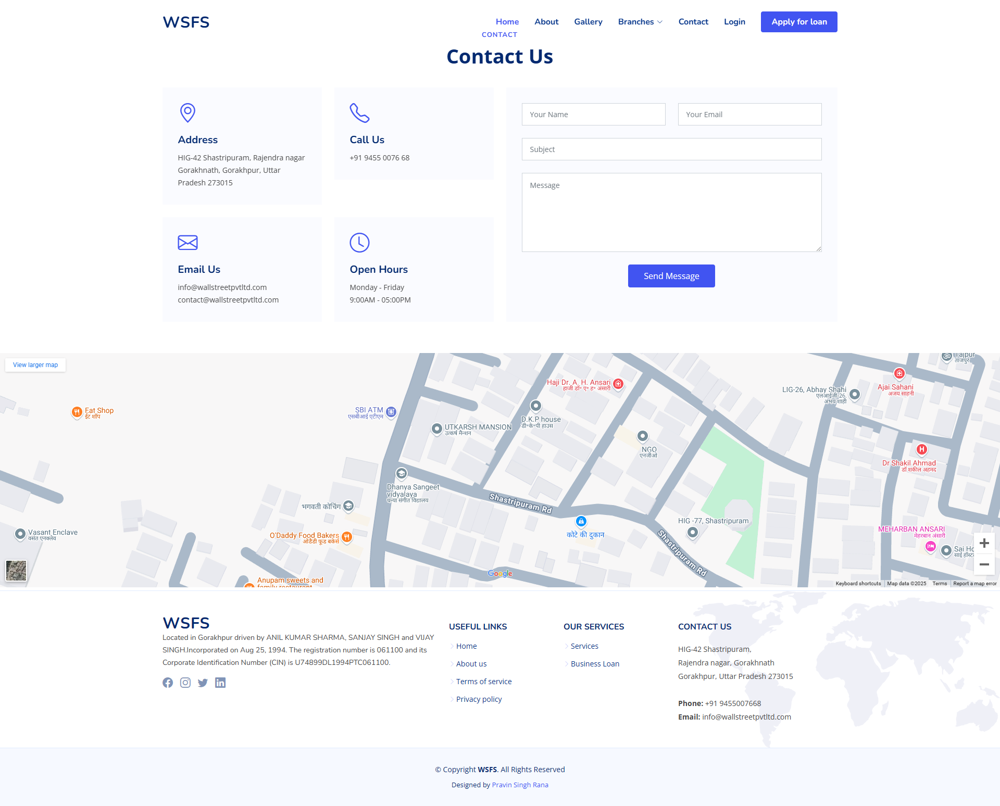
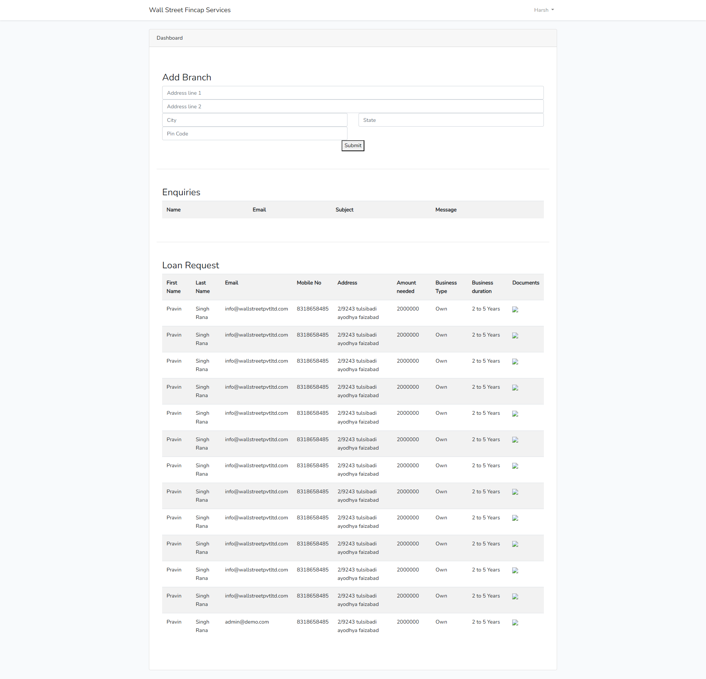

# WallStreet Pvt Ltd

Welcome to the WallStreet Pvt Ltd project repository. This project is a comprehensive web application designed to manage various aspects of a financial services company.

## Table of Contents

-   [Features](#features)
-   [Tech Stack](#tech-stack)
-   [Screenshots](#screenshots)
-   [Project Structure](#project-structure)
-   [Installation](#installation)
-   [Usage](#usage)
-   [Testing](#testing)
-   [Contributing](#contributing)
-   [License](#license)
-   [Contact](#contact)

## Features

-   **User Authentication**: Secure login and registration using Laravel Sanctum.
-   **API Integration**: Seamless integration with external APIs for real-time data.
-   **Responsive Design**: Fully responsive design using Bootstrap to ensure compatibility across all devices.
-   **Dynamic Content**: Interactive and dynamic content powered by JavaScript.
-   **CSS Styling**: Custom styles for a unique and professional look.
-   **Unit and Feature Testing**: Comprehensive test coverage using PHPUnit.

## Tech Stack

-   **Backend**: Laravel
-   **Frontend**: Bootstrap, JavaScript
-   **Authentication**: Laravel Sanctum
-   **Testing**: PHPUnit
-   **Package Management**: Composer, npm

## Screenshots

Here are some screenshots of the application:

### Home Page



### Gallery



### About



### Branches



### Contact



### Loan Form


### Dashboard



## Project Structure

-   `app/`: Contains the core application code including controllers, models, and services.
-   `bootstrap/`: Bootstrap files for initializing the application.
-   `config/`: Configuration files for various services and settings.
-   `database/`: Database migrations and seeders.
-   `public/`: Publicly accessible files including assets and the main entry point.
-   `resources/`: Views, language files, and other resources.
-   `routes/`: Route definitions for the application.
-   `storage/`: Storage for logs, cache, and other generated files.
-   `tests/`: Unit and feature tests.
-   `vendor/`: Composer dependencies.

## Prerequisites

-   PHP >= 7.4
-   Composer
-   Node.js >= 12.x
-   npm

## Installation

1. Clone the repository:
    ```sh
    git clone https://github.com/psrdev/wspltd.git
    ```
2. Navigate to the project directory:
    ```sh
    cd wallstreetpvtltd
    ```
3. Install dependencies:
    ```sh
    composer install
    npm install
    ```
4. Copy the example environment file and configure it:
    ```sh
    cp .env.example .env
    ```
5. Generate an application key:
    ```sh
    php artisan key:generate
    ```
6. Run database migrations:
    ```sh
    php artisan migrate
    ```

## Usage

-   Start the development server:
    ```sh
    php artisan serve
    ```
-   Compile assets:
    ```sh
    npm run dev
    ```

## Testing

Run the test suite:

```sh
phpunit
```
